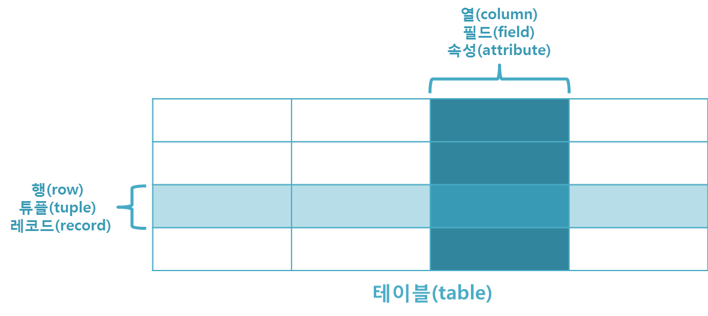

# 관계형 데이터베이스 용어
> 관계형 데이터베이스는 현재 가장 많이 사용되고 있는 데이터베이스의 한 종류다. 
관계형 데이터베이스란 테이블(table)로 이루어져 있으며, 이 테이블은 키(key)와 값(value)의 관계를 나타낸다. 
이처럼 데이터의 종속성을 관계(relationship)로 표현하는 것이 관계형 데이터베이스의 특징이다.
## Table (aka Relation)​
데이터를 기록하는 곳

테이블은 이름을 가지고 있으며, 행(row)과 열(column) 그리고 거기에 대응하는 값을 가진다. 
관계형 데이터베이스는 위와 같이 구성된 테이블이 다른 테이블들과 관계를 맺고 모여있는 집합체로 이해할 수 있다.
## ​Field(aka Column, Attribute)​
각 필드에는 고유한 데이터 형식(타입)이 지정됨
## Record(aka Row, Tuple)​
각 레코드에는 구체적인 데이터 값이 저장됨
## Database(aka Schema)
테이블의 집합, 스키마는 테이블을 디자인하기 위한 청사진이라고 할 수 있다. 
이러한 스키마는 테이블의 각 열에 대한 항목과 타입뿐만 아니라 기본 키와 외래 키도 나타내야 한다. 
스키마는 개체-관계 다이어그램(entity-relationship diagram)이나 문자열로 표현할 수 있다.
## Primary Key(PK, 기본키)
각 레코드의 고유한 값
관계형 데이터베이스에서 레코드의 식별자로 활용
## Foreign Key(FK, 외래키)
테이블의 필드 중 다른 테이블의 레코드를 식별할 수 있는 키 
각 레코드에서 서로 다른 테이블 간의 관계를 만드는 데 사용
