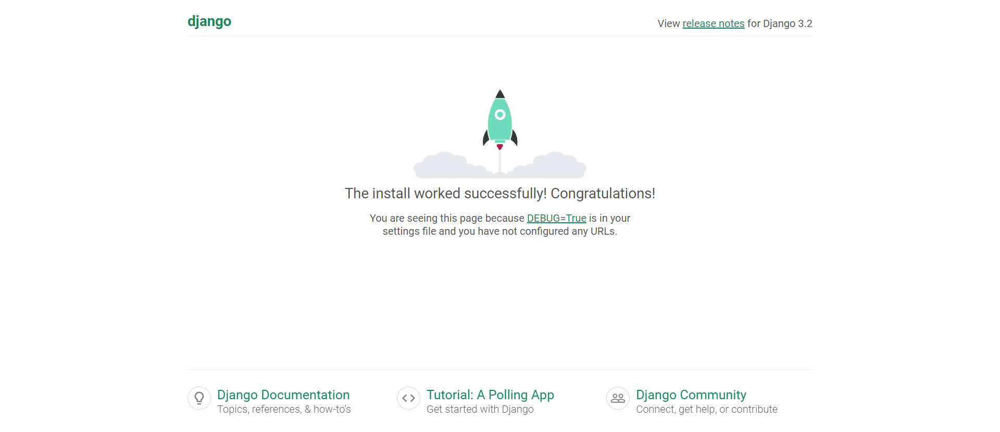

# 1. 개발 환경 설정 가이드 작성

> 아래 일련의 Django 개발 환경 설정 및 서버 실행 과정에 대한 나만의 가이드

## Django 프로젝트 생성 루틴

### 1. 가상환경 생성

- 가상환경 이름 : `venv`

`$ python -m venv venv`

### 2. 가상환경 활성화

- Tab을 이용하여 편하게

`$ source venv/Scripts/activate`

### 3. django 설치

- 설치 버전 : `3.2.18` (현 LTS)

`$ pip freeze > requirements.txt`

### 4. 의존성 파일 requirements.txt 생성

- 패키지 설치시마다 진행

`$ pip freeze > requirements.txt`

### 5. .gitignore 파일 생성

- 첫 `add` 전, git 초기화 시에 `.gitignore` 작성!
- [gitignore.io](https://www.toptal.com/developers/gitignore/)에서 편하게

`.gitignore` 파일 생성

### 6. git 저장소 생성

git 저장소 생성

### 7. django 프로젝트 생성

- firstpjt라는 이름의 프로젝트를 생성

`$ django-admin startproject firstpjt`

### 8. django 서버 실행

- `manage.py`와 동일한 경로에서 명령어 진행

`$ python manage.py runserver`

### 9. 로켓 발사 화면 확인

- 로켓 그림의 웹페이지가 열리면 성공!

[http://127.0.0.1:8000/](http://127.0.0.1:8000/) 접속 후 확인 

